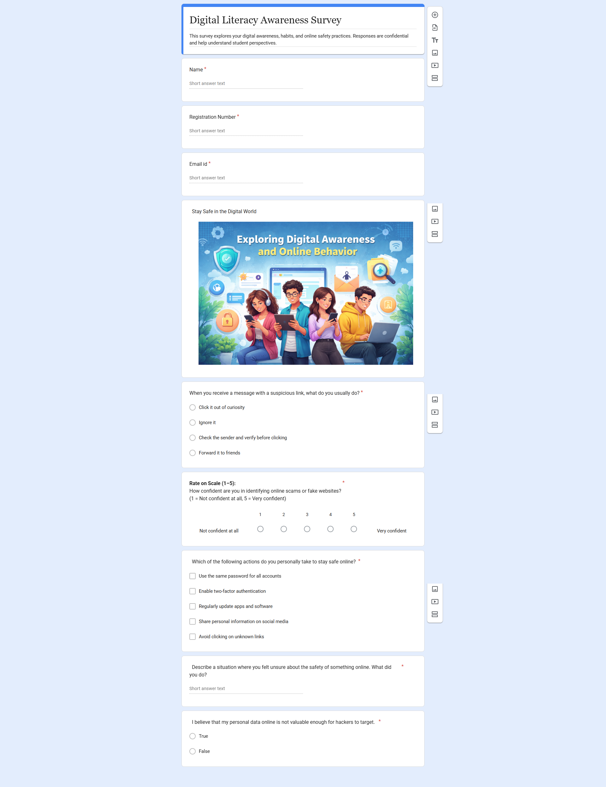
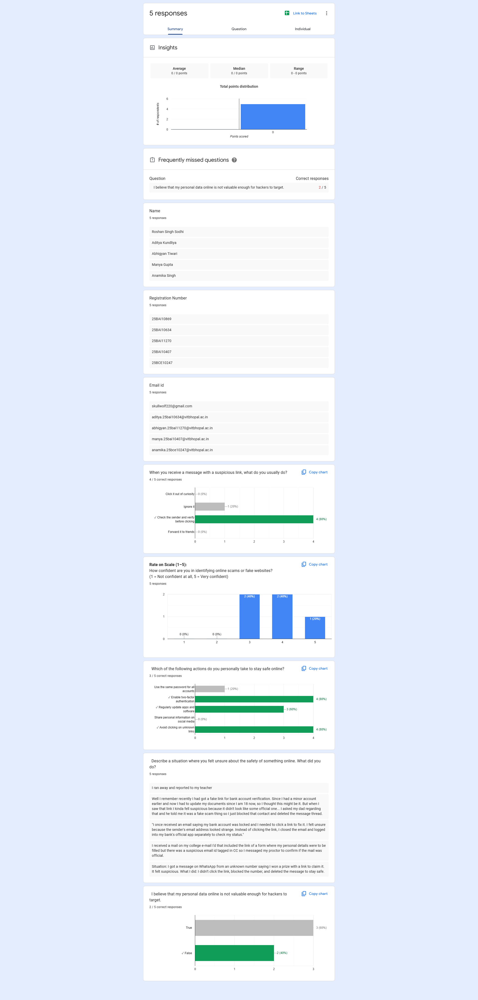

# 📋 Task 3 – Digital Literacy Awareness Survey

---

## 🌐 Overview
Created a **Digital Literacy Awareness Survey** using **Google Forms** to explore students'
digital awareness, online safety habits, and cybersecurity practices.
Responses are **confidential** and help understand student perspectives on staying safe online. 🔐

---

## 🔗 Form Link
> 👉 **[Click here to access the survey](https://docs.google.com/forms/d/e/1FAIpQLSedd6b22VRS84yHk5bRMWMNYInn4u8uR0TUKrhFMWdo0PjwdA/viewform?usp=header)**

---

## 📝 Form Details
| Field | Details |
|-------|---------|
| 📌 **Title** | Digital Literacy Awareness Survey |
| 📄 **Description** | Explores digital awareness, habits, and online safety practices among students |
| 🛠️ **Platform** | Google Forms |
| 🔒 **Responses** | Confidential |

---

## ❓ Questions Included

| # | Question | Type |
|---|----------|------|
| 1️⃣ | **Name** | 📝 Short Answer |
| 2️⃣ | **Registration Number** | 📝 Short Answer |
| 3️⃣ | **Email ID** | 📧 Short Answer |
| 4️⃣ | **Suspicious Link Behavior** | 🔘 Multiple Choice |
| 5️⃣ | **Confidence in Identifying Scams** | ⭐ Rating Scale (1–5) |
| 6️⃣ | **Online Safety Actions** | ☑️ Checkboxes |
| 7️⃣ | **Personal Safety Experience** | 💬 Open-ended |
| 8️⃣ | **Data Value Misconception** | ✅ True / False |

---

## 📊 Response Summary *(5 Responses)*

| Metric | Result |
|--------|--------|
| 🔗 Suspicious Link Handling | 4/5 chose **"Verify sender before clicking"** ✅ |
| 🎯 Scam Detection Confidence | Most rated **3–4 out of 5** ⭐⭐⭐⭐ |
| 🔐 Two-Factor Authentication | 4/5 enable 2FA ✅ |
| 🚫 Avoiding Unknown Links | 4/5 avoid unknown links ✅ |
| ⚠️ Data Value Misconception | Only 2/5 answered correctly ❌ *(most missed!)* |

---

## 🖼️ Screenshots

### 📋 Form View
> The survey form as seen by respondents on Google Forms.

---

### 📈 Google Sheet – Response Summary
> Live response data linked from Google Forms showing all 5 submissions.

---

> 💡 **Key Takeaway:** Students show strong awareness of basic online safety practices like
> 2FA and avoiding unknown links, but many still underestimate the value of their personal
> data — highlighting a critical area for further digital literacy education. 🎓
